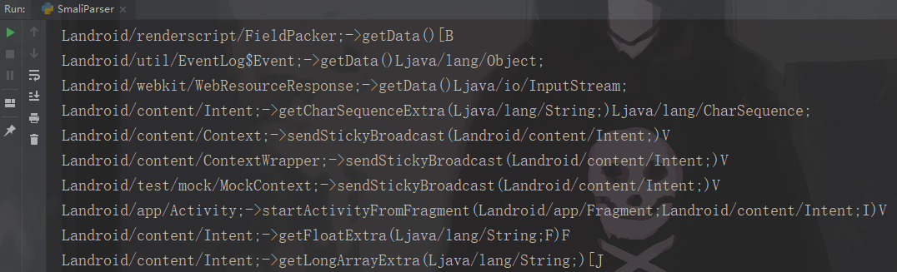

# Function Call Generation

**This is a little tool used to generated function call statements in smali bytecode form**
### 1、How it is realized
0x1 Convert target JAR package to DEX file.
0x2 Decompile the DEX file and Generate the smali files.
0x3 Parse the smali files and collect class information
0x4 search the method info by method name(Fuzzy query).

### 2、How to use it
0x1 Put the JAR file in the res directory.
0x2 Prepare some method names.
0x3 run the program.
And Soon you will get the corresponding function call statement in bytecode form.

### 3、Program output

### 3、FBI Warming
The file named funcInvokeConfig.txt contains some Android related sink points and source points Which may be useful to you.

												by pOny@moresec
												   2020/2/10
